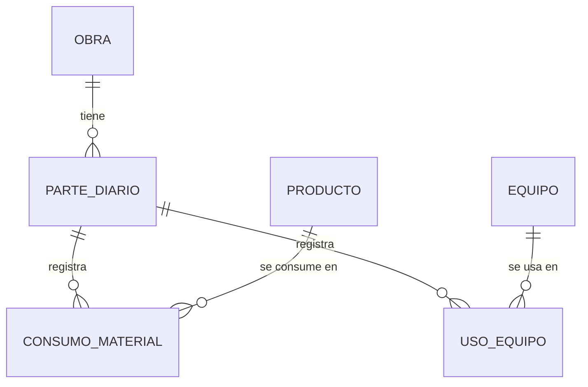

# Obrador

[](https://github.com/enri-escaray/obrador/actions/workflows/ci.yml)

Módulo de **Odoo 20** para la gestión de obras de una empresa constructora: obras,
partes diarios con avance físico, consumo de materiales y uso de equipos, más una
**API REST/JSON** para cargar y consultar partes diarios desde el obrador (una app
móvil, una planilla, otra integración), autenticada con API keys de Odoo.

## Funcionalidades

- **Obras**: código automático (`OB-0001`), cliente, jefe de obra, ubicación, fechas,
  presupuesto y ciclo de vida *planificada → en curso ⇄ suspendida → finalizada*
  (o *cancelada*). El avance actual se calcula a partir del último parte confirmado.
- **Partes diarios**: referencia `PD/2026/00001`, obra, fecha, avance físico
  acumulado (%), clima y observaciones. Nacen en *borrador* y un responsable los
  *confirma*; confirmados quedan bloqueados.
- **Consumo de materiales**: los materiales son productos de Odoo (tipo *bienes*),
  cada uno con su unidad de medida.
- **Uso de equipos**: catálogo de equipos con costo por hora; cada parte registra
  horas, operador y costo del día.
- **Reportes**: curva de avance por obra (gráfico de líneas) y tablas dinámicas de
  consumo de materiales y uso de equipos.
- **Seguridad**: grupos *Usuario* (carga partes) y *Responsable* (gestiona obras y
  equipos, confirma partes), con restricciones multi-compañía.
- **API REST/JSON** con API keys de Odoo de scope `obrador`.

## Stack

| Componente | Versión |
| --- | --- |
| Odoo Community | 20.0 (build `20260921`) |
| Python | 3.12 |
| PostgreSQL | 16 |
| Docker Compose | v2 o superior |

> **Sobre la imagen de Docker.** Odoo 20.0 se publicó el 21/09/2026 y Docker Hub
> todavía no tiene la imagen oficial `odoo:20`. Por eso [`docker/Dockerfile`](docker/Dockerfile)
> la construye a partir del paquete `.deb` oficial de nightly.odoo.com (fijado por
> versión y SHA-256), siguiendo la receta de [odoo/docker](https://github.com/odoo/docker).
> Cuando salga la imagen oficial, alcanza con reemplazar `build: ./docker` por
> `image: odoo:20` en `docker-compose.yml`.

## Estructura

```text
obrador/
├── addons/obrador/            # el módulo de Odoo
│   ├── controllers/api.py     # API REST/JSON
│   ├── data/                  # secuencias
│   ├── demo/                  # datos de ejemplo
│   ├── models/                # obra, parte diario, consumos, usos, equipos
│   ├── security/              # grupos y permisos (ir.access.csv de Odoo 20)
│   ├── tests/                 # tests de modelos y de la API
│   └── views/                 # vistas, acciones y menús
├── config/odoo.conf           # configuración de Odoo para desarrollo y CI
├── docker/Dockerfile          # imagen de Odoo 20.0
├── docker-compose.yml         # Odoo + PostgreSQL
├── pyproject.toml             # configuración de ruff
└── .github/workflows/ci.yml   # lint + tests en GitHub Actions
```

## Levantar el entorno

Requisitos: Docker con Docker Compose.

```bash
git clone https://github.com/enri-escaray/obrador.git
cd obrador
docker compose up -d
```

El primer arranque construye la imagen (unos minutos), crea la base `obrador` e
instala el módulo con datos de ejemplo. Después entrá a <http://localhost:8069> con
usuario `admin` y contraseña `admin`, y abrí la app **Obrador**.

Comandos útiles:

```bash
docker compose logs -f odoo                                     # ver el log
docker compose run --rm odoo -u obrador --stop-after-init       # actualizar el módulo
docker compose restart odoo                                     # reiniciar Odoo
docker compose down -v                                          # borrar todo (base incluida)
```

Todas las variables tienen valores por defecto y se pueden cambiar con un archivo
`.env` junto a `docker-compose.yml`: `POSTGRES_USER`, `POSTGRES_PASSWORD`,
`ODOO_DB` (nombre de la base) y `ODOO_PORT` (puerto publicado, `8069` por defecto).

## Modelo de datos



| Modelo | Descripción | Campos principales |
| --- | --- | --- |
| `obrador.obra` | Obra | `codigo`, `name`, `estado`, `cliente_id`, `responsable_id`, `fecha_inicio`, `fecha_fin_prevista`, `presupuesto`, `avance_actual` |
| `obrador.parte.diario` | Parte diario | `name`, `obra_id`, `fecha`, `avance`, `clima`, `observaciones`, `estado`, `consumo_ids`, `uso_equipo_ids`, `costo_equipos` |
| `obrador.consumo.material` | Consumo de material | `parte_id`, `product_id`, `cantidad`, `uom_id`, `notas` |
| `obrador.uso.equipo` | Uso de equipo | `parte_id`, `equipo_id`, `horas`, `operador`, `costo_hora`, `costo` |
| `obrador.equipo` | Equipo | `codigo`, `name`, `tipo`, `costo_hora` |

Las dos líneas del parte heredan del modelo abstracto `obrador.linea.parte`, que
aporta la relación con el parte, la obra, la fecha y la compañía.

### Reglas de negocio

- Solo se cargan partes en obras **en curso**, con fecha no futura y no anterior
  al inicio de la obra.
- **Un parte por obra y por día** (constraint en la base de datos).
- El avance va de 0 a 100 %; las cantidades deben ser positivas y las horas de
  equipo, mayores a 0 y hasta 24.
- Un parte **confirmado** no se puede modificar ni eliminar, ni tampoco sus líneas.
  Solo un responsable puede confirmarlo o volverlo a borrador.
- El **costo por hora** del equipo se copia al cargar la línea: si después cambia la
  tarifa, los partes ya cargados conservan el costo de ese día.
- Una obra con partes no se puede eliminar (se archiva o se cancela).

## API REST/JSON

Base: `http://localhost:8069/api/obrador/v1`. Las peticiones y respuestas son JSON
(`Content-Type: application/json` en los `POST`).

| Método | Ruta | Descripción |
| --- | --- | --- |
| `GET` | `/obras` | Lista obras. Filtro: `estado`. |
| `GET` | `/partes` | Lista partes diarios, del más reciente al más antiguo. Filtros: `obra_id`, `estado`, `fecha_desde`, `fecha_hasta`. |
| `GET` | `/partes/{id}` | Detalle de un parte diario. |
| `POST` | `/partes` | Crea un parte diario en borrador, con sus consumos y usos de equipo. |

Los listados aceptan `limit` (1 a 200, por defecto 50) y `offset`, y devuelven
`{"resultados": [...], "total": N, "limit": 50, "offset": 0}`.

### Autenticación con API key

La API usa las API keys nativas de Odoo con el scope **`obrador`**: se guardan
hasheadas, pueden vencer y el usuario las revoca desde sus preferencias. Una key de
este scope solo sirve para `/api/obrador/*` (no da acceso a XML-RPC ni a JSON-2).
Cada petición se ejecuta **con los permisos del usuario dueño de la key**, así que
ese usuario necesita el grupo *Obrador / Usuario* o *Responsable*.

Para generarla desde la interfaz: menú del usuario → *Mis preferencias* → pestaña
*Seguridad* → *Create API Key* (Odoo pide reconfirmar la contraseña) y elegí el scope
**Obrador (API de partes diarios)**.

Para pruebas locales también se puede generar una key sin vencimiento para `admin`
desde la consola de Odoo:

```bash
echo "print(env['res.users.apikeys'].with_user(env.ref('base.user_admin')).sudo()._generate('obrador', 'Pruebas locales', None)); env.cr.commit()" | docker compose run --rm -T odoo shell --no-http --log-level=warn
```

Se envía en la cabecera `Authorization`:

```bash
export API_KEY=...  # la key generada
curl -s http://localhost:8069/api/obrador/v1/obras?estado=en_curso \
  -H "Authorization: Bearer $API_KEY"
```

### Crear un parte diario

```bash
curl -s -X POST http://localhost:8069/api/obrador/v1/partes \
  -H "Authorization: Bearer $API_KEY" \
  -H "Content-Type: application/json" \
  -d '{
        "obra_id": 1,
        "fecha": "2026-09-24",
        "avance": 35.5,
        "clima": "soleado",
        "observaciones": "Hormigonado de losa del 3.er piso.",
        "consumos": [{"producto_id": 5, "cantidad": 18, "notas": "H-21"}],
        "equipos": [{"equipo_id": 2, "horas": 7.5, "operador": "Walter Gómez"}]
      }'
```

| Campo | Tipo | Obligatorio | Notas |
| --- | --- | --- | --- |
| `obra_id` | entero | sí | La obra tiene que estar en curso. |
| `avance` | número | sí | Avance físico acumulado, de 0 a 100. |
| `fecha` | `AAAA-MM-DD` | no | Por defecto, hoy (según la zona horaria del usuario). |
| `clima` | texto | no | `soleado`, `nublado`, `lluvia`, `tormenta` o `viento`. |
| `observaciones` | texto | no | |
| `consumos` | lista | no | `producto_id` y `cantidad` obligatorios; `notas` opcional. |
| `equipos` | lista | no | `equipo_id` y `horas` obligatorios; `operador` opcional. |

Responde `201 Created`, con la cabecera `Location` y el parte creado:

```json
{
  "id": 7,
  "referencia": "PD/2026/00007",
  "obra": {"id": 1, "codigo": "OB-0001", "nombre": "Edificio Mitre 1450"},
  "fecha": "2026-09-24",
  "avance": 35.5,
  "clima": "soleado",
  "observaciones": "Hormigonado de losa del 3.er piso.",
  "estado": "borrador",
  "consumos": [
    {"id": 12, "producto": {"id": 5, "nombre": "Hormigón elaborado H-21"}, "cantidad": 18.0, "unidad": "m³", "notas": "H-21"}
  ],
  "equipos": [
    {"id": 9, "equipo": {"id": 2, "nombre": "Grúa torre Potain"}, "horas": 7.5, "operador": "Walter Gómez", "costo": 675.0}
  ],
  "costo_equipos": 675.0,
  "moneda": "USD",
  "cargado_por": {"id": 2, "nombre": "Mitchell Admin"}
}
```

### Listar partes diarios

```bash
curl -s "http://localhost:8069/api/obrador/v1/partes?obra_id=1&fecha_desde=2026-09-01&limit=20" \
  -H "Authorization: Bearer $API_KEY"
```

### Errores

Los errores usan el formato JSON estándar de Odoo (el mismo de su API JSON-2):

```json
{
  "name": "odoo.exceptions.ValidationError",
  "message": "El avance debe estar entre 0 y 100.",
  "arguments": ["El avance debe estar entre 0 y 100."],
  "context": {},
  "debug": "odoo.exceptions.ValidationError: El avance debe estar entre 0 y 100.\n",
  "timestamp": 1790265600
}
```

| Código | Cuándo |
| --- | --- |
| `400` | JSON mal formado, cuerpo que no es un objeto o parámetros de consulta inválidos. |
| `401` | Falta la API key, es inválida, venció o no tiene el scope `obrador`. |
| `403` | El usuario de la key no tiene permisos sobre el módulo. |
| `404` | El parte diario no existe o no es visible para el usuario. |
| `409` | Ya existe un parte para esa obra y esa fecha. |
| `415` | El `POST` no se envió como `application/json`. |
| `422` | Datos inválidos: campos faltantes o desconocidos, tipos incorrectos, reglas de negocio. |

## Tests

Hay tests de modelos (`TransactionCase`) y de la API (`HttpCase`, con peticiones
HTTP reales contra el servidor de Odoo):

- `tests/test_obra.py`: secuencia, ciclo de vida, avance actual, borrado y permisos.
- `tests/test_parte_diario.py`: validaciones, unicidad por día, costos, bloqueo de
  partes confirmados y permisos por grupo.
- `tests/test_api.py`: autenticación (key inválida, de otro scope, usuario sin
  permisos), alta con validaciones, duplicados, listados con filtros y paginación.

Para correrlos localmente en una base nueva:

```bash
docker compose run --rm odoo -d test_obrador -i obrador --with-demo \
  --test-tags /obrador --stop-after-init
```

Para repetirlos, borrá antes esa base: `docker compose exec db dropdb -U odoo test_obrador`.

## Integración continua

[`.github/workflows/ci.yml`](.github/workflows/ci.yml) corre en cada push a `main` y
en cada pull request:

1. **Lint**: `ruff check` y `ruff format --check`.
2. **Tests**: construye la imagen de Odoo 20.0 (con caché de capas), levanta
   PostgreSQL con el mismo `docker-compose.yml`, instala el módulo con datos demo y
   corre la suite. Falla si algún test falla o si el log tiene líneas `ERROR` o
   `CRITICAL`, y publica el log como artefacto.

## Desarrollo

Chequeo de estilo con [ruff](https://docs.astral.sh/ruff/) (la configuración está en
`pyproject.toml`):

```bash
pip install ruff
ruff check . && ruff format --check .
```

## Licencia

LGPL-3, como se declara en el manifiesto del módulo.
